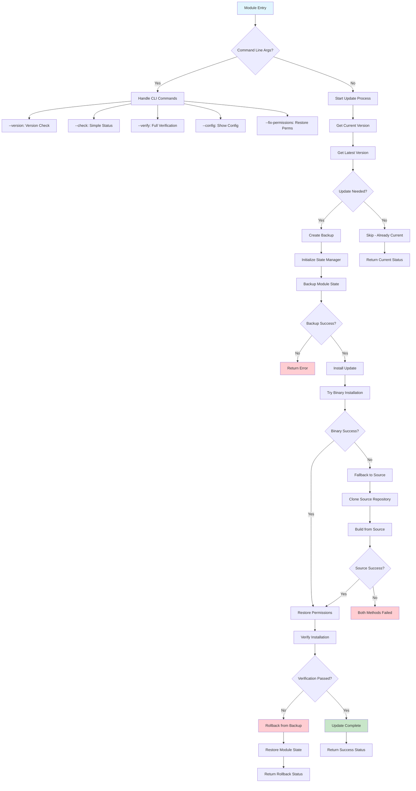

# Gogs Update Module

## Workflow Diagram

```mermaid
flowchart TD
    A[Module Entry] --> B{Command Line Args?}
    
    B -->|Yes| C[Handle CLI Commands]
    B -->|No| D[Start Update Process]
    
    C --> C1[--version: Version Check]
    C --> C2[--check: Simple Status]
    C --> C3[--verify: Full Verification]
    C --> C4[--config: Show Config]
    C --> C5[--fix-permissions: Restore Perms]
    
    D --> E[Get Current Version]
    E --> F[Get Latest Version]
    F --> G{Update Needed?}
    
    G -->|No| H[Skip - Already Current]
    G -->|Yes| I[Create Backup]
    
    I --> J[Initialize State Manager]
    J --> K[Backup Module State]
    K --> L{Backup Success?}
    
    L -->|No| M[Return Error]
    L -->|Yes| N[Install Update]
    
    N --> O[Try Binary Installation]
    O --> P{Binary Success?}
    
    P -->|Yes| Q[Restore Permissions]
    P -->|No| R[Fallback to Source]
    
    R --> S[Clone Source Repository]
    S --> T[Build from Source]
    T --> U{Source Success?}
    
    U -->|No| V[Both Methods Failed]
    U -->|Yes| Q
    
    Q --> W[Verify Installation]
    W --> X{Verification Passed?}
    
    X -->|No| Y[Rollback from Backup]
    X -->|Yes| Z[Update Complete]
    
    Y --> AA[Restore Module State]
    AA --> BB[Return Rollback Status]
    
    H --> CC[Return Current Status]
    Z --> DD[Return Success Status]
    
    style A fill:#e1f5fe
    style Z fill:#c8e6c9
    style M fill:#ffcdd2
    style V fill:#ffcdd2
    style Y fill:#ffcdd2
``` 