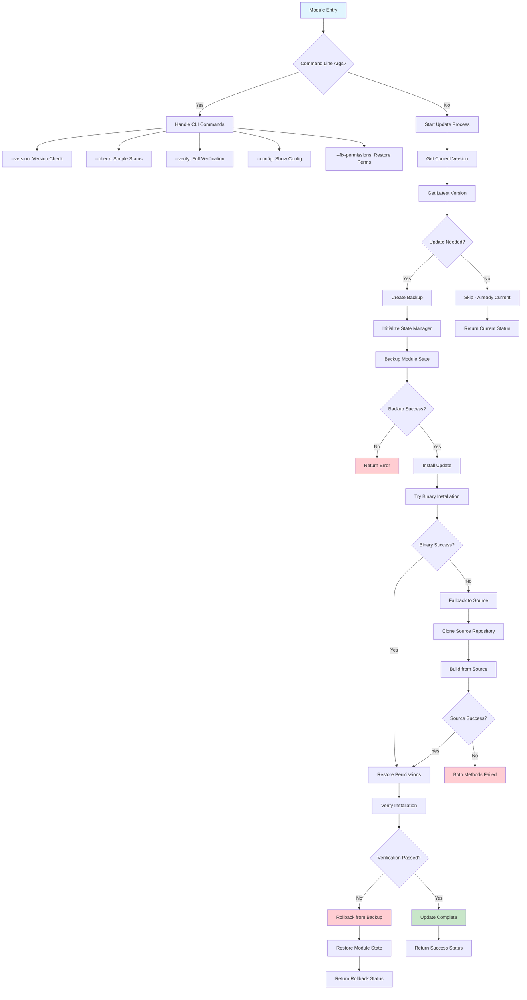

# Gogs Update Module

## Binary URL and fallback (why updates failed on 0.14+)

GitHub release asset **file names changed** between 0.13.x and 0.14.x:

| Release | Example asset name |
|--------|---------------------|
| 0.13.3 | `gogs_0.13.3_linux_amd64.tar.gz` |
| 0.14.2 | `gogs_v0.14.2_linux_amd64.tar.gz` |

A single `binary_download_url_template` using `gogs_{version}_linux_amd64.tar.gz` matches 0.13.x but **404s on 0.14.x** (missing the extra `v` in the archive name).

**Resolution in code:** `resolve_gogs_linux_amd64_tarball_url()` loads the release’s `assets` from the GitHub API and picks the `linux_amd64` `.tar.gz`. If the API is unavailable, it probes two known URL patterns with `HEAD`.

**Source fallback:** Upstream removed the old `Makefile` `build` target; 0.14 uses `go build` (see `Taskfile.yml`). The module now runs `go build` and reuses the same **data-preserving** swap as the tarball path. Older distro Go versions may still fail if below Gogs’ `go.mod` requirement; prefer the binary path.

**Forgejo:** If the host is migrated to Forgejo, `detect_git_server()` skips this module.

## Workflow Diagram

