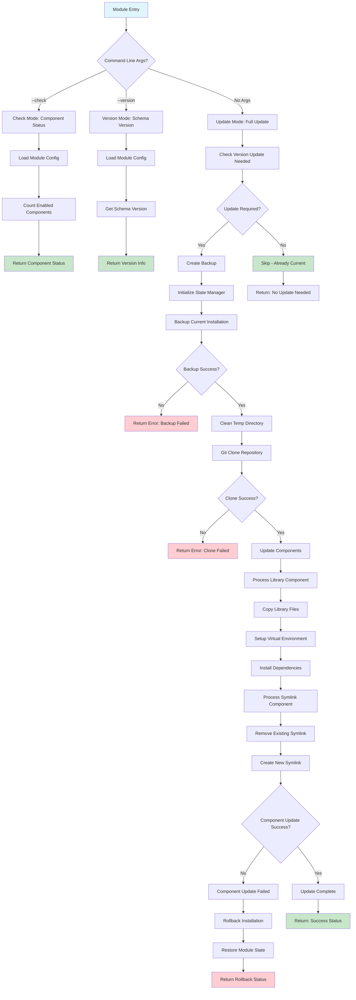

# Linker Update Module

## Workflow Diagram

```mermaid
flowchart TD
    A[Module Entry] --> B{Command Line Args?}
    
    B -->|--check| C[Check Mode: Component Status]
    B -->|--version| D[Version Mode: Schema Version]
    B -->|No Args| E[Update Mode: Full Update]
    
    C --> C1[Load Module Config]
    C1 --> C2[Count Enabled Components]
    C2 --> C3[Return Component Status]
    
    D --> D1[Load Module Config]
    D1 --> D2[Get Schema Version]
    D2 --> D3[Return Version Info]
    
    E --> F[Check Version Update Needed]
    F --> G{Update Required?}
    
    G -->|No| H[Skip - Already Current]
    G -->|Yes| I[Create Backup]
    
    I --> J[Initialize State Manager]
    J --> K[Backup Current Installation]
    K --> L{Backup Success?}
    
    L -->|No| M[Return Error: Backup Failed]
    L -->|Yes| N[Clean Temp Directory]
    
    N --> O[Git Clone Repository]
    O --> P{Clone Success?}
    
    P -->|No| Q[Return Error: Clone Failed]
    P -->|Yes| R[Update Components]
    
    R --> S[Process Library Component]
    S --> T[Copy Library Files]
    T --> U[Setup Virtual Environment]
    U --> V[Install Dependencies]
    
    V --> W[Process Symlink Component]
    W --> X[Remove Existing Symlink]
    X --> Y[Create New Symlink]
    
    Y --> Z{Component Update Success?}
    
    Z -->|No| AA[Component Update Failed]
    Z -->|Yes| BB[Update Complete]
    
    AA --> CC[Rollback Installation]
    CC --> DD[Restore Module State]
    DD --> EE[Return Rollback Status]
    
    H --> FF[Return: No Update Needed]
    BB --> GG[Return: Success Status]
    
    style A fill:#e1f5fe
    style GG fill:#c8e6c9
    style H fill:#c8e6c9
    style C3 fill:#c8e6c9
    style D3 fill:#c8e6c9
    style M fill:#ffcdd2
    style Q fill:#ffcdd2
    style EE fill:#ffcdd2
``` 

need to remove --version cli interface