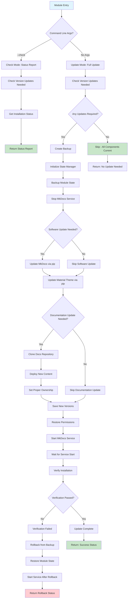

# MkDocs Update Module

## Purpose

The MkDocs update module manages three components of the HOMESERVER documentation system:

1. **MkDocs Software**: The documentation generator application itself
2. **Material Theme**: The MkDocs Material theme package
3. **Documentation Content**: The actual documentation files served by MkDocs

### Documentation Content Updates

**This is NOT about reference material or documentation structure.** This module handles the complete synchronization of documentation files from the remote repository to each individual HomeServer instance.

**How it works:**
- On every update run, the module clones the full documentation repository from GitHub
- It compares the repository's `VERSION` file against the local version
- If versions differ, it performs a **complete content replacement**:
  - Removes all existing documentation files from `/opt/docs/docs/`
  - Copies all files and directories from the repository's `docs/` subdirectory
  - Copies `mkdocs.yml` configuration file
  - Copies `VERSION` file for tracking
  - Sets proper file ownership and permissions
- If any file or directory fails to copy, the update fails and logs the error

**Key Points:**
- The module pulls the **entire repository** on every update (not incremental)
- It performs a **full replacement** of local docs with repo content (not a merge)
- Missing files/directories in the repo will be removed from local (complete sync)
- All directories and files from `docs/` are copied, including new ones like `reference/`
- The update only runs if the repository `VERSION` differs from local version

**Repository:**
- URL: `https://github.com/homeserversltd/documentation.git`
- Local path: `/opt/docs/docs/`
- Version tracking: `/opt/docs/VERSION` and `/opt/docs/.docs_version`

## Workflow Diagram

