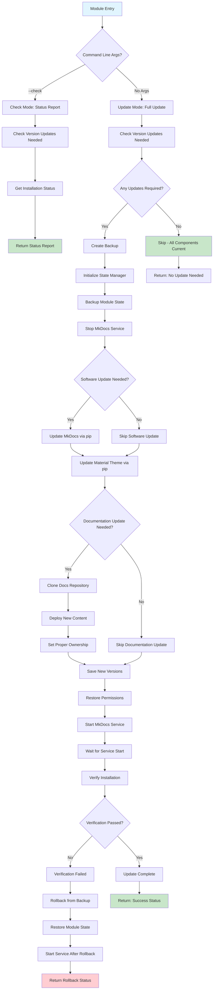

# MkDocs Update Module

## Workflow Diagram

```mermaid
flowchart TD
    A[Module Entry] --> B{Command Line Args?}
    
    B -->|--check| C[Check Mode: Status Report]
    B -->|No Args| D[Update Mode: Full Update]
    
    C --> C1[Check Version Updates Needed]
    C1 --> C2[Get Installation Status]
    C2 --> C3[Return Status Report]
    
    D --> E[Check Version Updates Needed]
    E --> F{Any Updates Required?}
    
    F -->|No| G[Skip - All Components Current]
    F -->|Yes| H[Create Backup]
    
    H --> I[Initialize State Manager]
    I --> J[Backup Module State]
    J --> K[Stop MkDocs Service]
    
    K --> L{Software Update Needed?}
    
    L -->|Yes| M[Update MkDocs via pip]
    L -->|No| N[Skip Software Update]
    
    M --> O[Update Material Theme via pip]
    N --> O
    
    O --> P{Documentation Update Needed?}
    
    P -->|Yes| Q[Clone Docs Repository]
    P -->|No| R[Skip Documentation Update]
    
    Q --> S[Deploy New Content]
    S --> T[Set Proper Ownership]
    T --> U[Save New Versions]
    
    R --> U
    
    U --> V[Restore Permissions]
    V --> W[Start MkDocs Service]
    W --> X[Wait for Service Start]
    X --> Y[Verify Installation]
    
    Y --> Z{Verification Passed?}
    
    Z -->|No| AA[Verification Failed]
    Z -->|Yes| BB[Update Complete]
    
    AA --> CC[Rollback from Backup]
    CC --> DD[Restore Module State]
    DD --> EE[Start Service After Rollback]
    EE --> FF[Return Rollback Status]
    
    G --> GG[Return: No Update Needed]
    BB --> HH[Return: Success Status]
    
    style A fill:#e1f5fe
    style HH fill:#c8e6c9
    style G fill:#c8e6c9
    style C3 fill:#c8e6c9
    style FF fill:#ffcdd2
``` 