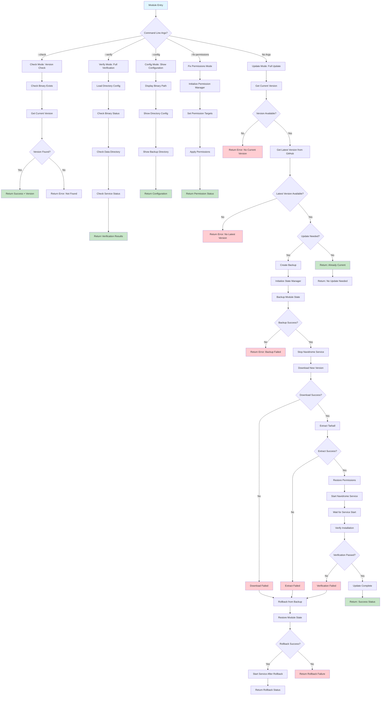

# Navidrome Update Module

## Workflow Diagram

```mermaid
flowchart TD
    A[Module Entry] --> B{Command Line Args?}
    
    B -->|--check| C[Check Mode: Version Check]
    B -->|--verify| D[Verify Mode: Full Verification]
    B -->|--config| E[Config Mode: Show Configuration]
    B -->|--fix-permissions| F[Fix Permissions Mode]
    B -->|No Args| G[Update Mode: Full Update]
    
    C --> C1[Check Binary Exists]
    C1 --> C2[Get Current Version]
    C2 --> C3{Version Found?}
    C3 -->|Yes| C4[Return Success + Version]
    C3 -->|No| C5[Return Error: Not Found]
    
    D --> D1[Load Directory Config]
    D1 --> D2[Check Binary Status]
    D2 --> D3[Check Data Directory]
    D3 --> D4[Check Service Status]
    D4 --> D5[Return Verification Results]
    
    E --> E1[Display Binary Path]
    E1 --> E2[Show Directory Config]
    E2 --> E3[Show Backup Directory]
    E3 --> E4[Return Configuration]
    
    F --> F1[Initialize Permission Manager]
    F1 --> F2[Set Permission Targets]
    F2 --> F3[Apply Permissions]
    F3 --> F4[Return Permission Status]
    
    G --> H[Get Current Version]
    H --> I{Version Available?}
    
    I -->|No| J[Return Error: No Current Version]
    I -->|Yes| K[Get Latest Version from GitHub]
    
    K --> L{Latest Version Available?}
    
    L -->|No| M[Return Error: No Latest Version]
    L -->|Yes| N{Update Needed?}
    
    N -->|No| O[Return: Already Current]
    N -->|Yes| P[Create Backup]
    
    P --> Q[Initialize State Manager]
    Q --> R[Backup Module State]
    R --> S{Backup Success?}
    
    S -->|No| T[Return Error: Backup Failed]
    S -->|Yes| U[Stop Navidrome Service]
    
    U --> V[Download New Version]
    V --> W{Download Success?}
    
    W -->|No| X[Download Failed]
    W -->|Yes| Y[Extract Tarball]
    
    Y --> Z{Extract Success?}
    
    Z -->|No| AA[Extract Failed]
    Z -->|Yes| BB[Restore Permissions]
    
    BB --> CC[Start Navidrome Service]
    CC --> DD[Wait for Service Start]
    DD --> EE[Verify Installation]
    EE --> FF{Verification Passed?}
    
    FF -->|No| GG[Verification Failed]
    FF -->|Yes| HH[Update Complete]
    
    X --> II[Rollback from Backup]
    AA --> II
    GG --> II
    
    II --> JJ[Restore Module State]
    JJ --> KK{Rollback Success?}
    
    KK -->|Yes| LL[Start Service After Rollback]
    LL --> MM[Return Rollback Status]
    KK -->|No| NN[Return Rollback Failure]
    
    O --> OO[Return: No Update Needed]
    HH --> PP[Return: Success Status]
    
    style A fill:#e1f5fe
    style PP fill:#c8e6c9
    style O fill:#c8e6c9
    style C4 fill:#c8e6c9
    style D5 fill:#c8e6c9
    style E4 fill:#c8e6c9
    style F4 fill:#c8e6c9
    style J fill:#ffcdd2
    style M fill:#ffcdd2
    style T fill:#ffcdd2
    style X fill:#ffcdd2
    style AA fill:#ffcdd2
    style GG fill:#ffcdd2
    style NN fill:#ffcdd2
``` 