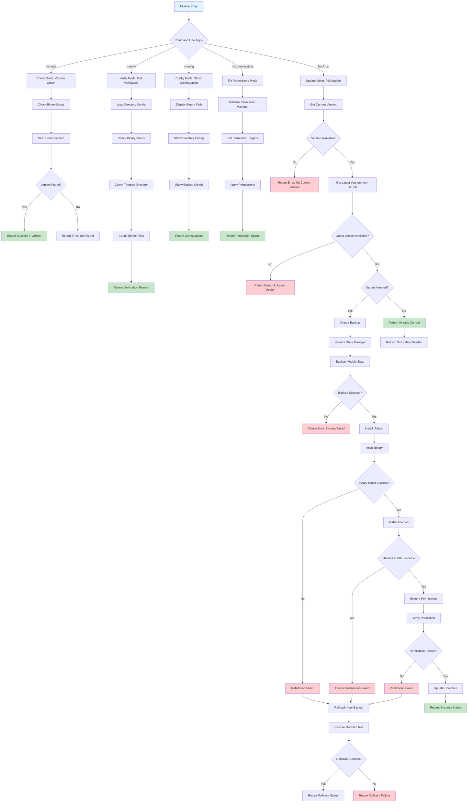

# Oh My Posh Update Module

## Workflow Diagram

```mermaid
flowchart TD
    A[Module Entry] --> B{Command Line Args?}
    
    B -->|--check| C[Check Mode: Version Check]
    B -->|--verify| D[Verify Mode: Full Verification]
    B -->|--config| E[Config Mode: Show Configuration]
    B -->|--fix-permissions| F[Fix Permissions Mode]
    B -->|No Args| G[Update Mode: Full Update]
    
    C --> C1[Check Binary Exists]
    C1 --> C2[Get Current Version]
    C2 --> C3{Version Found?}
    C3 -->|Yes| C4[Return Success + Version]
    C3 -->|No| C5[Return Error: Not Found]
    
    D --> D1[Load Directory Config]
    D1 --> D2[Check Binary Status]
    D2 --> D3[Check Themes Directory]
    D3 --> D4[Count Theme Files]
    D4 --> D5[Return Verification Results]
    
    E --> E1[Display Binary Path]
    E1 --> E2[Show Directory Config]
    E2 --> E3[Show Backup Config]
    E3 --> E4[Return Configuration]
    
    F --> F1[Initialize Permission Manager]
    F1 --> F2[Set Permission Targets]
    F2 --> F3[Apply Permissions]
    F3 --> F4[Return Permission Status]
    
    G --> H[Get Current Version]
    H --> I{Version Available?}
    
    I -->|No| J[Return Error: No Current Version]
    I -->|Yes| K[Get Latest Version from GitHub]
    
    K --> L{Latest Version Available?}
    
    L -->|No| M[Return Error: No Latest Version]
    L -->|Yes| N{Update Needed?}
    
    N -->|No| O[Return: Already Current]
    N -->|Yes| P[Create Backup]
    
    P --> Q[Initialize State Manager]
    Q --> R[Backup Module State]
    R --> S{Backup Success?}
    
    S -->|No| T[Return Error: Backup Failed]
    S -->|Yes| U[Install Update]
    
    U --> V[Install Binary]
    V --> W{Binary Install Success?}
    
    W -->|No| X[Installation Failed]
    W -->|Yes| Y[Install Themes]
    
    Y --> Z{Themes Install Success?}
    
    Z -->|No| AA[Themes Installation Failed]
    Z -->|Yes| BB[Restore Permissions]
    
    BB --> CC[Verify Installation]
    CC --> DD{Verification Passed?}
    
    DD -->|No| EE[Verification Failed]
    DD -->|Yes| FF[Update Complete]
    
    X --> GG[Rollback from Backup]
    AA --> GG
    EE --> GG
    
    GG --> HH[Restore Module State]
    HH --> II{Rollback Success?}
    
    II -->|Yes| JJ[Return Rollback Status]
    II -->|No| KK[Return Rollback Failure]
    
    O --> LL[Return: No Update Needed]
    FF --> MM[Return: Success Status]
    
    style A fill:#e1f5fe
    style MM fill:#c8e6c9
    style O fill:#c8e6c9
    style C4 fill:#c8e6c9
    style D5 fill:#c8e6c9
    style E4 fill:#c8e6c9
    style F4 fill:#c8e6c9
    style J fill:#ffcdd2
    style M fill:#ffcdd2
    style T fill:#ffcdd2
    style X fill:#ffcdd2
    style AA fill:#ffcdd2
    style EE fill:#ffcdd2
    style KK fill:#ffcdd2
``` 

this one needs refactored eventually to only have the flags that index.py will actually send to it.