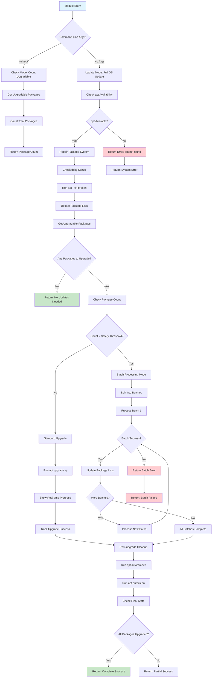

# OS Module

## Workflow Diagram

## Purpose

The os module provides operating system update management for HOMESERVER. It handles system-level package updates, security patches, and maintenance operations to keep the underlying operating system current and secure.

## What It Does

- **System Updates**: Manages operating system package updates through the system package manager
- **Security Patches**: Automatically applies critical security updates to maintain system security
- **Package Management**: Handles package installation, removal, and cleanup operations
- **System Maintenance**: Performs routine maintenance tasks like cache cleaning and dependency resolution
- **Batch Processing**: Intelligently processes large update sets to maintain system stability
- **Repair Operations**: Detects and repairs common package system issues

## Why It Matters

Operating system security and stability form the foundation of HOMESERVER's reliability. The os module ensures that the underlying system remains secure, stable, and up-to-date without manual intervention:

- **Security Foundation**: Keeps the base system protected against known vulnerabilities
- **System Stability**: Maintains package integrity and resolves dependency conflicts
- **Automated Maintenance**: Reduces administrative overhead through intelligent automation
- **Risk Management**: Processes updates safely to prevent system instability
- **Compliance**: Ensures systems meet security update requirements
- **Uptime Protection**: Minimizes service disruption through careful update management

## Integration with HOMESERVER

The os module integrates with HOMESERVER's infrastructure to provide seamless system maintenance. It coordinates with other modules to ensure updates don't interfere with running services while maintaining system security and stability.

## Key Features

- **Intelligent Batching**: Automatically processes large update sets in manageable batches
- **System Repair**: Detects and fixes common package system issues before updates
- **Progress Tracking**: Provides real-time feedback during update operations
- **Safety Controls**: Implements safeguards to prevent system instability during updates
- **Cleanup Operations**: Removes unnecessary packages and cleans system caches
- **Verification**: Validates system state before and after update operations

This module ensures HOMESERVER's operating system foundation remains secure, stable, and current without requiring manual system administration. 