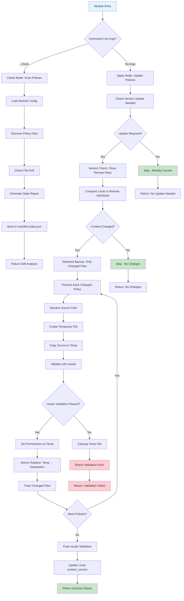

# Permissions Update Module

## Workflow Diagram

```mermaid
flowchart TD
    A[Module Entry] --> B{Command Line Args?}
    
    B -->|--check| C[Check Mode: Scan Policies]
    B -->|No Args| D[Apply Mode: Update Policies]
    
    C --> C1[Load Module Config]
    C1 --> C2[Discover Policy Files]
    C2 --> C3[Check File Drift]
    C3 --> C4[Generate State Report]
    C4 --> C5[Save to manifest.state.json]
    C5 --> C6[Return Drift Analysis]
    
    D --> E[Check Version Update Needed]
    E --> F{Update Required?}
    
    F -->|No| G[Skip - Already Current]
    F -->|Yes| H[Version Check: Clone Remote Repo]
    
    H --> I[Compare Local vs Remote VERSION]
    I --> J{Content Changed?}
    
    J -->|No| K[Skip - No Changes]
    J -->|Yes| L[Selective Backup: Only Changed Files]
    
    L --> M[Process Each Changed Policy]
    M --> N[Resolve Source Path]
    N --> O[Create Temporary File]
    O --> P[Copy Source to Temp]
    P --> Q[Validate with visudo]
    
    Q --> R{visudo Validation Passed?}
    
    R -->|No| S[Cleanup Temp File]
    S --> T[Return Validation Error]
    R -->|Yes| U[Set Permissions on Temp]
    
    U --> V[Atomic Replace: Temp → Destination]
    V --> W[Track Changed Files]
    W --> X{More Policies?}
    
    X -->|Yes| M
    X -->|No| Y[Final visudo Validation]
    
    Y --> Z[Update Local content_version]
    Z --> AA[Return Success Status]
    
    G --> BB[Return: No Update Needed]
    K --> CC[Return: No Changes]
    T --> DD[Return: Validation Failed]
    
    style A fill:#e1f5fe
    style AA fill:#c8e6c9
    style G fill:#c8e6c9
    style K fill:#c8e6c9
    style T fill:#ffcdd2
    style DD fill:#ffcdd2
```
