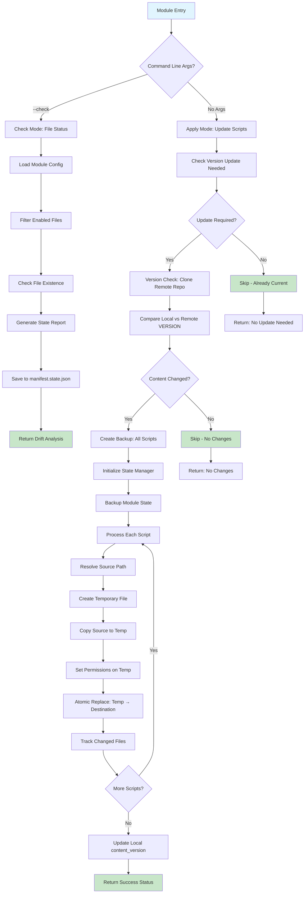

# Sbin Update Module

## Workflow Diagram

```mermaid
flowchart TD
    A[Module Entry] --> B{Command Line Args?}
    
    B -->|--check| C[Check Mode: File Status]
    B -->|No Args| D[Apply Mode: Update Scripts]
    
    C --> C1[Load Module Config]
    C1 --> C2[Filter Enabled Files]
    C2 --> C3[Check File Existence]
    C3 --> C4[Generate State Report]
    C4 --> C5[Save to manifest.state.json]
    C5 --> C6[Return Drift Analysis]
    
    D --> E[Check Version Update Needed]
    E --> F{Update Required?}
    
    F -->|No| G[Skip - Already Current]
    F -->|Yes| H[Version Check: Clone Remote Repo]
    
    H --> I[Compare Local vs Remote VERSION]
    I --> J{Content Changed?}
    
    J -->|No| K[Skip - No Changes]
    J -->|Yes| L[Create Backup: All Scripts]
    
    L --> M[Initialize State Manager]
    M --> N[Backup Module State]
    N --> O[Process Each Script]
    
    O --> P[Resolve Source Path]
    P --> Q[Create Temporary File]
    Q --> R[Copy Source to Temp]
    R --> S[Set Permissions on Temp]
    
    S --> T[Atomic Replace: Temp → Destination]
    T --> U[Track Changed Files]
    U --> V{More Scripts?}
    
    V -->|Yes| O
    V -->|No| W[Update Local content_version]
    
    W --> X[Return Success Status]
    
    G --> Y[Return: No Update Needed]
    K --> Z[Return: No Changes]
    
    style A fill:#e1f5fe
    style X fill:#c8e6c9
    style G fill:#c8e6c9
    style K fill:#c8e6c9
    style C6 fill:#c8e6c9
```

